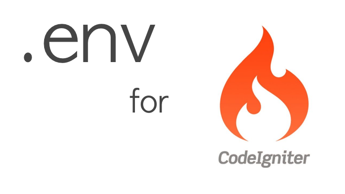

# PHP dotenv for codeigniter
> Autodetect environment type and load variables from `.env` to `getenv()` automagically.

This is a PHP version of the original [Ruby dotenv](https://github.com/bkeepers/dotenv).



## Manual Installation without Composer
1. Copy folder **system** to your codeigniter projects.
2. Add this code to your codeigniter index.php before codeigniter core loaded (before this text "* LOAD THE BOOTSTRAP FILE") :
    ```php
		/*
		 * --------------------------------------------------------------------
		 * LOAD PHP DOT ENV FILE
		 * --------------------------------------------------------------------
		 *
		 * And away we go...
		 *
		 */
		require_once BASEPATH . 'dotenv/autoloader.php';
		
		$dotenv = new Dotenv\Dotenv(__DIR__);
		$dotenv->load();
    ```

## Configuration
1. Create **.env** according your environment by copy file **.env.example** for database configuration and the other configuration. 
Example : **.env.development**, **.env.testing**, **.env.production**

2. Load configuration, in file **application/config/database.php** change to this configuration
```php
	$db['default']['hostname'] = getenv('DB_HOST');
	$db['default']['username'] = getenv('DB_USERNAME');
	$db['default']['password'] = getenv('DB_PASSWORD');
	$db['default']['database'] = getenv('DB_DATABASE');
	$db['default']['dbdriver'] = getenv('DB_CONNECTION');
```
3. Add ".env" to your .gitignore file
4. It will be running, thank you

## Release History

* 0.1.1
    * CHANGE: Autodetect environment & Update Readme
* 0.1.0
    * Initial version

## Meta

Agung Jati Kusumo – [@its_agungjk](https://twitter.com/its_agungjk) – agungjk.social@gmail.com

Distributed under the MIT license. See ``LICENSE`` for more information.

[https://github.com/agungjk/phpdotenv-for-codeigniter](https://github.com/agungjk/phpdotenv-for-codeigniter)

## Contributing

1. Fork it (<https://github.com/agungjk/phpdotenv-for-codeigniter/fork>)
2. Create your feature branch (`git checkout -b feature/fooBar`)
3. Commit your changes (`git commit -am 'Add some fooBar'`)
4. Push to the branch (`git push origin feature/fooBar`)
5. Create a new Pull Request